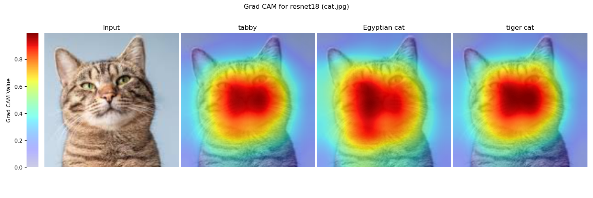
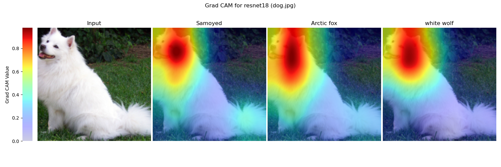
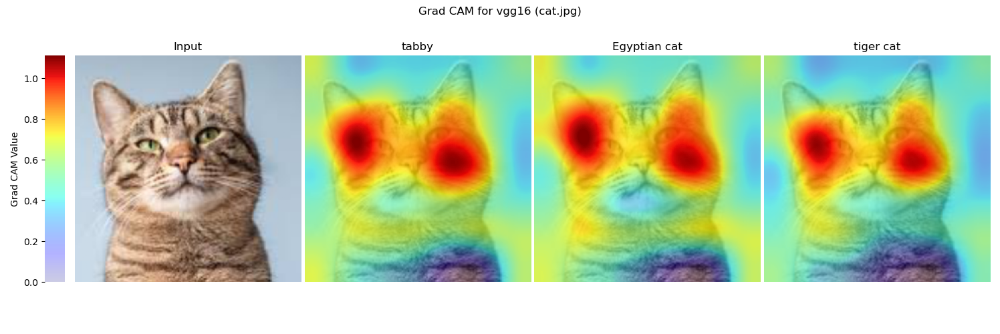
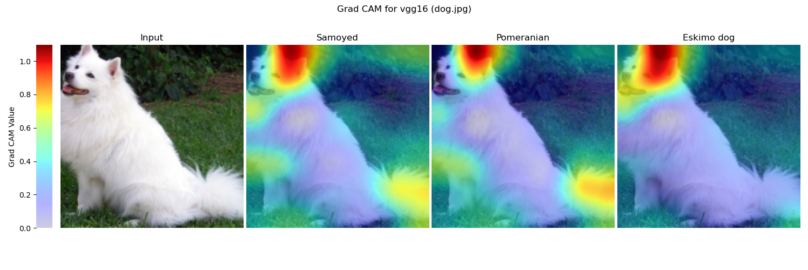
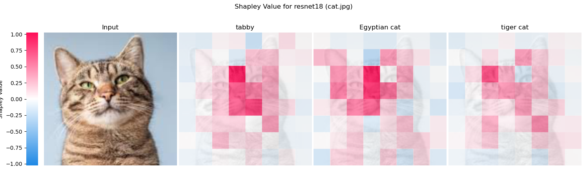
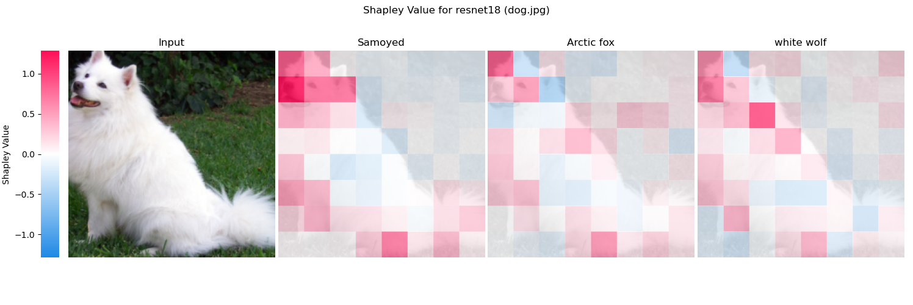

## Required task: Handwritten digit classification

## Optional Task 2: Visualization methods to explain DNNs

In optional task 2, I implemented Grad-CAM and Shapley Value to explain ResNet-18 and VGG-16 pre-trained model.

### Grad-CAM

1. Denote the model output for class $c$ by $y^c$. Compute the gradient of $y^c$ with respect to feature map activations $A^k$ of a convolutional layer (the last layer in my implementation), i.e., $\frac{\partial y^{c}}{\partial A^{k}}\in \mathbb{R}^{u \times v} $, where $k$ is the index of the feature map and $u,v$ are width and height of the feature map, respectively.

2. Compute the global-average-pooled of the gradients over width and height dimensions:
   $$
   \alpha_{k}^{c}=\overbrace{\frac{1}{Z} \sum_{i} \sum_{j}}^{\text {global average pooling }} \underbrace{\frac{\partial y^{c}}{\partial A_{i j}^{k}}}_{\text {gradients via backprop }}
   $$

3. Compute final Grad-CAM, the sum of feature maps weighted by $\alpha^c_k$ and filtered by ReLU.
   $$
   L_{\text {Grad-CAM }}^{c}=\operatorname{ReLU} \underbrace{\left(\sum_{k} \alpha_{k}^{c} A^{k}\right)}_{\text {linear combination }}
   $$

4. For visualization, I upsampled the Grad-CAM to the image's shape.

### Shapley Value

1. Treat the input image as a collection of multiple patches, denoted as $N = \{1,2,\cdots,i,\cdots, |N|\}$. 	

2. Denote the probability of class $c$ from model output by $p_c$.

3. Define the value function $v: 2^N \rightarrow \mathbb{R}$
   $$
   v(x) = \log \frac{p_c}{1-p_c},x \,\in2^N
   $$

4. Shapley value of $i$:
   $$
   \phi(i) = \mathbb{E}_{S \subseteq N\setminus\{i\},}\left[v(S\cup\{i\})-v(S)\right],
   $$

​		where $S$ is the context of $i$ .

### Results

### Discussion

Grad-CAM and Shapley Value show similar importance distribution in the above two cases,    i.e. the models focused more on the head of the animal. Furthermore, for the dog image, both methods reflect the model's focus on the tail.

The difference between the two methods is that Grad-CAM retains only positive values because it uses ReLU, while Shapley Value can be negative to reflect the negative contribution of the input variable to the output. In addition, Shapley Value is model-agnostic and has the nature of efficiency ($\sum_{i}\phi(i)=v(N)$), whereas the Grad-CAM is neither.

## Optional Task 3: Binary sentiment classification on SST-2 dataset 

In optional task 2, I implemented long short-term memory (LSTM) network for binary sentiment classification on SST-2 dataset and visualize intermediate-layer features by PCA and t-SNE.

### Long short-term memory (LSTM)