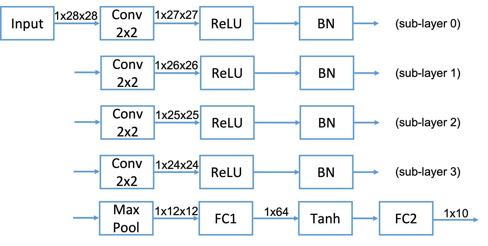

# ML Final Project

In addition to the required task, I seleted optional task 2 and optional task 3 for this project.

[TOC]

## Required task: Handwritten digit classification

### Network architecture

I defined a sub-layer that includes a convolutional layer, a relu and a batch norm layer. Then I repeat this sub-layer four times and finally get the 10-dimensional output after max pooling and a feed-forward network. The main reason for this design is to satisfy the requirements, and in fact, in my experiments, the removal of relu or batch norm only had a slight effect on the final results. 


```python
MNISTClassifier(
  (layers): ModuleDict(
    (sub-layer0): Sequential(
      (conv): Conv2d(1, 1, kernel_size=(2, 2), stride=(1, 1))
      (relu): ReLU()
      (bn): BatchNorm2d(1, eps=1e-05, momentum=0.1, affine=True, track_running_stats=True)
    )
    (sub-layer1): Sequential(
      (conv): Conv2d(1, 1, kernel_size=(2, 2), stride=(1, 1))
      (relu): ReLU()
      (bn): BatchNorm2d(1, eps=1e-05, momentum=0.1, affine=True, track_running_stats=True)
    )
    (sub-layer2): Sequential(
      (conv): Conv2d(1, 1, kernel_size=(2, 2), stride=(1, 1))
      (relu): ReLU()
      (bn): BatchNorm2d(1, eps=1e-05, momentum=0.1, affine=True, track_running_stats=True)
    )
    (sub-layer3): Sequential(
      (conv): Conv2d(1, 1, kernel_size=(2, 2), stride=(1, 1))
      (relu): ReLU()
      (bn): BatchNorm2d(1, eps=1e-05, momentum=0.1, affine=True, track_running_stats=True)
    )
  )
  (max_pool): MaxPool2d(kernel_size=(2, 2), stride=(2, 2), padding=0, dilation=1, ceil_mode=False)
  (fc1): Linear(in_features=144, out_features=64, bias=True)
  (fc2): Linear(in_features=64, out_features=10, bias=True)
  (tanh): Tanh()
)
```



**Hyper-parameter**

The only hyperparameter is  `learning rate=0.001`. To reproduce the result, see [Usage](#Usage).


### Training Curves

**Best loss and accuracy**

|              | Train  | Valid  |
| :----------: | :----: | :----: |
|   **Loss**   | 0.1607 | 0.1576 |
| **Accuracy** | 0.9516 | 0.9522 |


**Training loss**


**Valid loss**


**Valid acc**


### Feature visualization


The data points are more dispersed after PCA because it maximizes the variance of the data. The t-SNE clustering is more obvious because it retains the neighbor relationship. In addition, the features of the fully-connected layers are more distinguishable than those of the previous layers.

## Optional Task 2: Visualization methods to explain DNNs

In optional task 2, I implemented Grad-CAM and Shapley Value to explain ResNet-18 and VGG-16 pre-trained model.

### Grad-CAM

1. Denote the model output for class $c$ by $y^c$. Compute the gradient of $y^c$ with respect to feature map activations $A^k$ of a convolutional layer (the last layer in my implementation), i.e., $\frac{\partial y^{c}}{\partial A^{k}}\in \mathbb{R}^{u \times v} $, where $k$ is the index of the feature map and $u,v$ are width and height of the feature map, respectively.

2. Compute the global-average-pooled of the gradients over width and height dimensions:
   $$
   \alpha_{k}^{c}=\overbrace{\frac{1}{Z} \sum_{i} \sum_{j}}^{\text {global average pooling }} \underbrace{\frac{\partial y^{c}}{\partial A_{i j}^{k}}}_{\text {gradients via backprop }}
   $$

3. Compute final Grad-CAM, the sum of feature maps weighted by $\alpha^c_k$ and filtered by ReLU.
   $$
   L_{\text {Grad-CAM }}^{c}=\operatorname{ReLU} \underbrace{\left(\sum_{k} \alpha_{k}^{c} A^{k}\right)}_{\text {linear combination }}
   $$

4. For visualization, I upsampled the Grad-CAM to the image's shape.

### Shapley Value

1. Treat the input image as a collection of multiple patches, denoted as $N = \{1,2,\cdots,i,\cdots, |N|\}$. 	

2. Denote the probability of class $c$ from model output by $p_c$.

3. Define the value function $v: 2^N \rightarrow \mathbb{R}$
   $$
   v(x) = \log \frac{p_c}{1-p_c},x \,\in2^N
   $$

4. Shapley value of $i$:
   $$
   \phi(i) = \mathbb{E}_{S \subseteq N\setminus\{i\},}\left[v(S\cup\{i\})-v(S)\right],
   $$

​		where $S$ is the context of $i$ .

### Results

**Grad-CAM**


**Shapley Value**


### Discussion

Grad-CAM and Shapley Value show similar importance distribution in the above two cases,    i.e. the models focused more on the head of the animal. Furthermore, for the dog image, both methods reflect the model's focus on the tail.

The difference between the two methods is that Grad-CAM retains only positive values because it uses ReLU, while Shapley Value can be negative to reflect the negative contribution of the input variable to the output. In addition, Shapley Value is model-agnostic and has the nature of efficiency ($\sum_{i}\phi(i)=v(N)$), whereas the Grad-CAM is neither.


## Optional Task 3: Binary sentiment classification on SST-2 dataset 

In optional task 3, I implemented long short-term memory (LSTM) network for binary sentiment classification on SST-2 dataset and visualize intermediate-layer features by PCA and t-SNE.

### Long short-term memory (LSTM)

LSTM networks are a speical kind of recurrent neural networks (RNN). The LSTM exploits structures called gates to control information flow in each step. A gate can be defined as:
$$
\textrm{Gate}(x, h) = \textrm{activation}(\textrm{Linear}(x)+\textrm{Linear}(h)),
$$
where $\textrm{activation}$ can be choosen from $\textrm{sigmoid}$ or $\textrm{tanh}$, and $\textrm{Linear}$ is a linear transformation with weights and bias as its parameters.

LSTM do the following computaions for step $t$:
$$
\begin{aligned}
&f_{t}=\textrm{Gate}_{forget}(x_t,h_{t-1}) \\
&i_{t}=\textrm{Gate}_{input}(x_t,h_{t-1}) \\
&\hat{c}_{t}=\textrm{Gate}_{cell}(x_t,h_{t-1}) \\
&o_{t}=\textrm{Gate}_{output}(x_t,h_{t-1}) \\
&c_{t}=f_{t} \odot c_{t-1}+i_{t} \odot \hat{c}_{t} \\
&h_{t}=o_{t} \odot \tanh \left(c_{t}\right)
\end{aligned}
$$
where $\odot $ is element-wise product and $x_t$ is the input at step $t$.

### Training curves

**Best loss and accuracy**

|              | Train  | Valid  |
| :----------: | :----: | :----: |
|   **Loss**   | 0.1381 | 0.4661 |
| **Accuracy** | 0.9482 | 0.8268 |

**Training loss**


**Valid loss**


**Valid acc**


### Feature visualization


Both PCA and t-SNE show clustering of different categories of samples. PCA shows the two dimensions with the largest sample variance, while t-SNE preserves the neighbor relationship in the high-dimensional space.

## Usage

**Note:** Use `python3 xxx.py --help` to see the full usage


**Dependencies**

```
pip3 install -r requirements.txt
```


**Required task: Handwritten digit classification**

```shell
mkdir logs

# train
python3 run-mnist-classification.py | tee -a logs/mnist.log

# plot training curves
python3 plot-log.py --log-file logs/mnist.log --out-dir ./imgs --prefix mnist

# eval and plot feature visualization
python3 run-mnist-classification.py --eval-only --restore-file ckpts/mnist-classifier/checkpoint_best.pt 

```


**Optional task 2: Visualization methods to explain DNNs**

```shell
# grad cam
python3 run-grad-cam.py --input cat.jpg --ptm resnet18
python3 run-grad-cam.py --input dog.jpg --ptm resnet18
python3 run-grad-cam.py --input cat.jpg --ptm vgg16
python3 run-grad-cam.py --input dog.jpg --ptm vgg16

# shap value
python3 run-shapley-value.py --input cat.jpg --ptm resnet18
python3 run-shapley-value.py --input dog.jpg --ptm resnet18
python3 run-shapley-value.py --input cat.jpg --ptm vgg16
python3 run-shapley-value.py --input dog.jpg --ptm vgg16

```


**Optional task 3: Binary sentiment classification on SST-2 dataset **

```shell
mkdir logs

# train
python3 run-sst2-classification.py | tee -a logs/sst2.log 

# plot training curves
python3 plot-log.py --log-file logs/sst2.log --out-dir ./imgs --prefix sst2

# eval and plot feature visualization
python3 run-sst2-classification.py --eval-only --restore-file ckpts/lstm/checkpoint_best.pt 
```

